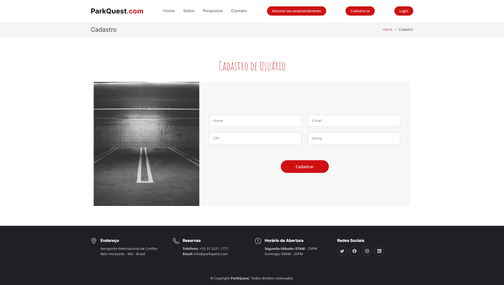

# Template Padrão da Aplicação

A construção do design a ser utilizado na aplicação ParkQuest foi feito através do Marvel e tem como base o protótipo e o projeto de interface já apresentados. Para permitir a responsividade do layout foram utilizadas estruturas do Bootstrap.

## Tela de cadastro de motorista

