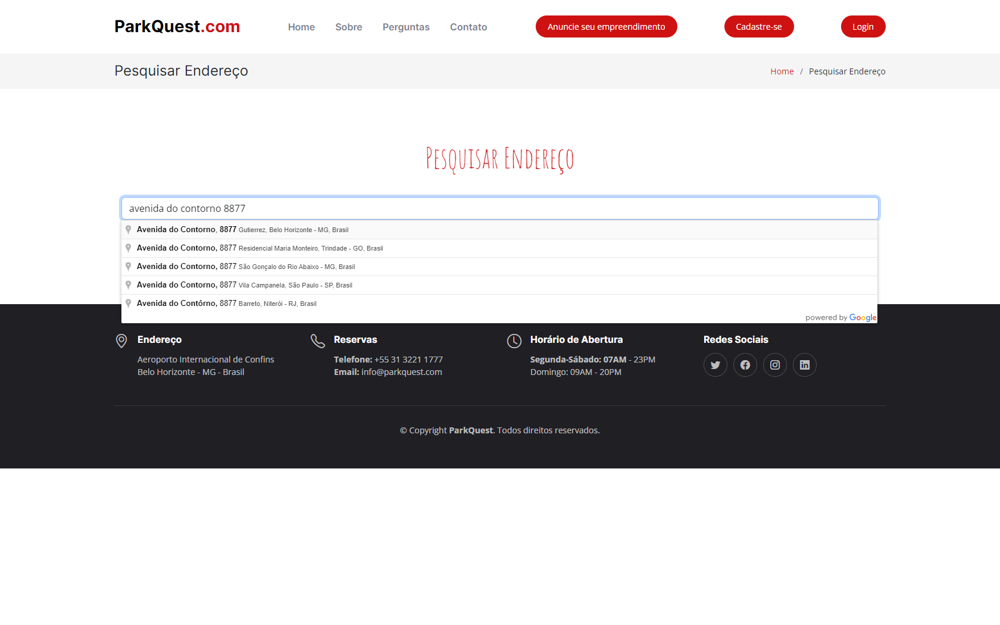
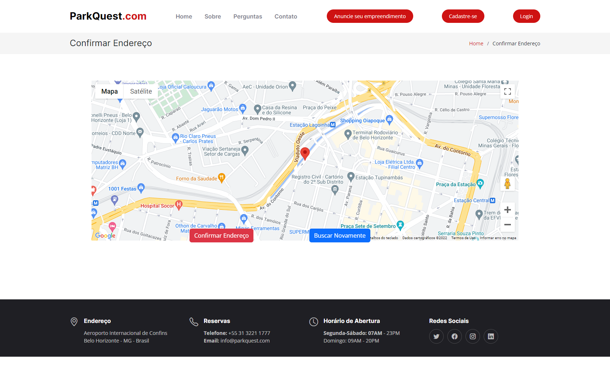
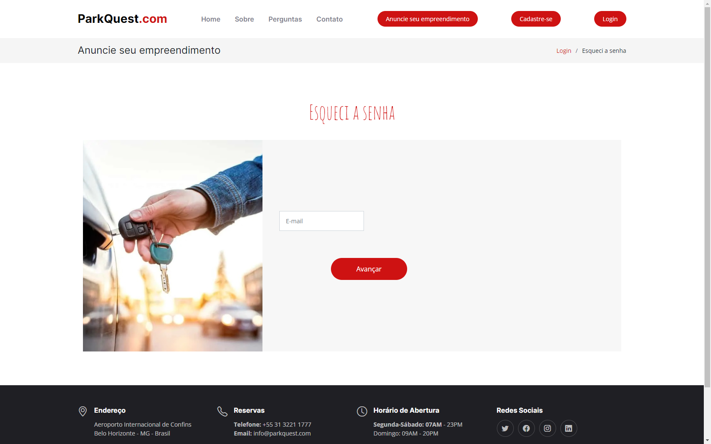
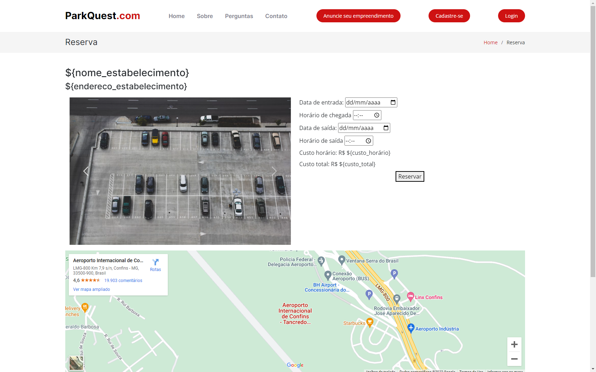
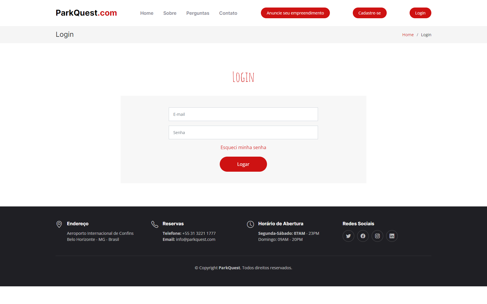

# Programação de Funcionalidades

Nesta seção são apresentadas as telas desenvolvidas para cada uma das funcionalidades do sistema.

Abra um navegador de Internet e informe a seguinte URL: https://parkquest20221030220308.azurewebsites.net/

## Cadastre-se (RF-03/ RFN-01,02,03,04)

A Tela Inicial do sistema apresenta o cadastro de usuários, com os campos que devem ser preenchidos obrigatóriamente: nome, e-mail, senha e CPF. Sendo que nele possui a função de Create, Edit, Details e Delete. Para quaisquer tipos de alterações das informações, no banco de dados do SQL Server.

### Requisitos atendidos 

- RF-03 - A aplicação deverá ter uma página de cadastro do motorista, com os campos, nome, e-mail, senha, cadastro e CPF. | ALTA |-
- RNF-03 - A aplicação deverá ter uma página de cadastro do motorista, com os campos, nome, e-mail, senha, cadastro e CPF. 
- RNF-01 - A aplicação deve ser publicada em um ambiente acessível publicamente na Internet.	
- RNF-02 - A aplicação deve ser responsiva, permitindo a visualização em um celular, desktop, tablet de forma adequada.	
- RNF-03 - A aplicação deve ser compatível com os principais navegadores do mercado (Google Chrome, Firefox, Microsoft Edge).	
- RNF-04 - O desenvolvimento deve ser em HTML, CSS, Javascript, BD SQL, C# podendo utilizar frameworks.	

### Artefatos da funcionalidade 

- cadastro.html
- template.html
- main.js
- main.css
- Usuario.cs
- UsuarioController.cs
- ApplicationDbContext.cs

### Estrutura de Dados 

        using System;
        using System.Collections.Generic;
        using System.Linq;
        using System.Threading.Tasks;
        using Microsoft.AspNetCore.Mvc;
        using Microsoft.AspNetCore.Mvc.Rendering;
        using Microsoft.EntityFrameworkCore;
        using Dominio.Entidades;
        using ParkQuest.Models;

        namespace ParkQuest.Controllers
        {
        public class UsuarioController : Controller
        {
        private readonly ApplicationDbContext _context;

        public UsuarioController(ApplicationDbContext context)
        {
            _context = context;
        }

        // GET: Usuario
        public async Task<IActionResult> Index()
        {
            return View(await _context.Usuarios.ToListAsync());
        }

        // GET: Usuario/Details/5
        public async Task<IActionResult> Details(int? id)
        {
            if (id == null)
            {
                return NotFound();
            }

            var usuario = await _context.Usuarios
                .FirstOrDefaultAsync(m => m.id == id);
            if (usuario == null)
            {
                return NotFound();
            }

            return View(usuario);
        }

### Instruções de acesso 

Para efetuar o cadastro, o usuário deverá clicar no botão anuncie seu empreendimento na tela principal.

## Anuncie seu empreendimento (RF-05,06/ RFN-01,02,03,04)

A Tela Inicial do sistema apresenta o cadastro de estacionamentos, com os campos que devem ser preenchidos obrigatoriamente: nome estabelecimento, endereço, quantidade de vagas, e-mail, CNPJ, cidade, valor por hora e senha. Sendo que nele possui a função de Create, Edit, Details e Delete. Para quaisquer tipos de alterações das informações, no banco de dados do SQL Server.

### Requisitos atendidos 

- RF-05 -  A aplicação deve conter uma aba no cabeçalho "Anuncie seu empreendimento" com a funcionalidade de, ao clicar nela, abrir uma nova página com um formulário para o cadastro de novos empreendimentos.
- RF - 06 - O formulário de cadastro de novos empreendimentos deve conter: nome, e-mail, celular, estado, cidade, CNPJ, endereço, quantidade de vagas, tabela de preços e fotos do local.
- RNF-01 - A aplicação deve ser publicada em um ambiente acessível publicamente na Internet.	
- RNF-02 - A aplicação deve ser responsiva, permitindo a visualização em um celular, desktop, tablet de forma adequada.	
- RNF-03 - A aplicação deve ser compatível com os principais navegadores do mercado (Google Chrome, Firefox, Microsoft Edge).	
- RNF-04 - O desenvolvimento deve ser em HTML, CSS, Javascript, BD SQL, C# podendo utilizar frameworks.	

### Artefatos da funcionalidade 

- anuncie.html
- template.html
- main.js
- main.css
- Estacionamento.cs
- EstacionamentoController.cs
- ApplicationDbContext.cs

### Estrutura de Dados 

        using System;
        using System.Collections.Generic;
        using System.Linq;
        using System.Threading.Tasks;
        using Microsoft.AspNetCore.Mvc;
        using Microsoft.AspNetCore.Mvc.Rendering;
        using Microsoft.EntityFrameworkCore;
        using Dominio.Entidades;
        using ParkQuest.Models;

        namespace ParkQuest.Controllers
        {
        public class EstacionamentoController : Controller
        {
        private readonly ApplicationDbContext _context;

        public EstacionamentoController(ApplicationDbContext context)
        {
            _context = context;
        }

        // GET: Estacionamento
        public async Task<IActionResult> Index()
        {
            return View(await _context.Estacionamentos.ToListAsync());
        }

        // GET: Estacionamento/Details/5
        public async Task<IActionResult> Details(int? id)
        {
            if (id == null)
            {
                return NotFound();
            }

            var estacionamento = await _context.Estacionamentos
                .FirstOrDefaultAsync(m => m.id == id);
            if (estacionamento == null)
            {
                return NotFound();
            }

            return View(estacionamento);
        }

### Instruções de acesso 

Para efetuar o cadastro do empreendimento, o usuário deverá clicar no botão anuncie seu empreendimento na tela principal.

## Buscar Endereço, Mapa e API Mapa (RF-09,1017/ RFN-01,02,03,04)
Na tela buscar endereço o usuário poderá digitar o endereço que pretende ir e confirmar a localização no mapa, para poder visualizar os estacionamentos disponíveis na proximidade.

### Requisitos atendidos 
A aplicação deverá ter a localização precisa no com o local que o usuário motorista pretende ir.
- RF-09 - A aplicação deverá ter a localização precisa no mapa com o local que o usuário motorista pretende ir.
- RF-10 - Após o usuário informar a localização que pretende ir deverá ser encaminhado para a página de reserva, em que deverá informar e data de entrada e saída, a aplicação deve apresentar a funcionalidade de mostrar as informações em lista com os estacionamentos, disponibilidade, 
- RF-17 - A aplicação deve ter um campo em que o usuário motorista vai preencher com o endereço que pretende ir.
- RNF-01 - A aplicação deve ser publicada em um ambiente acessível publicamente na Internet.
- RNF-02 - A aplicação deve ser responsiva, permitindo a visualização em um celular, desktop, tablet de forma adequada.
- RNF-03 - A aplicação deve ser compatível com os principais navegadores do mercado (Google Chrome, Firefox, Microsoft Edge).
- RNF-04 - O desenvolvimento deve ser em HTML, CSS, Javascript, BD SQL, C# podendo utilizar frameworks.

### Artefatos da funcionalidade 
- pesquisarendereco.html
- mapa.html
- mapa.js
- mapa.css
- pesquisarendereco.css
- pesquisarendereco.js
- index.css
- main.js
- main.css

### Estrutura de Dados

    
	

    function iniciarMapa() {
        mapa = new google.maps.Map(itemMapa, {
            center: coordenadas,
            zoom: 4,});
            geocoder = new google.maps.Geocoder();
        window.onload = geocodeAddress(geocoder);
               
    }

    function geocodeAddress(geocoder) {
        let seminterrogacao = valor.replace ("?","");
        geocoder.geocode({'address': seminterrogacao}, function(results, status) 
        {
          if (status === 'OK') {
              mapa.setCenter(results[0].geometry.location);
              mapa.setZoom(16);
              marker = new google.maps.Marker({
              map: mapa,
              position: results[0].geometry.location
            });
              
          } else {
            alert('Algo deu errado: ' + status + ' Tente Novamente!');
            window.location.href = "index.html";
          }
          sessionStorage.setItem('localizacao-usuario', results[0].geometry.location);               
        });
      }

    window.initMap = iniciarMapa;

### Instruções de acesso 

O usuário motorista deverá clicar no botão reservar na página principal, ele será redirecionado para a página pesquisar endereço, em que deverá digitar o endereço que pretende ir e apertar o botão confirmar, após isso a página do mapa será aberta e o usuário deverá verificar se a localização no mapa está correta, ele poderá confirmar o endereço e ir para a página de reserva ou buscar novamente, para alterar o endereço buscado. 

## Esqueci a Senha e Alterar a Senha (RF-/ RFN-)
Caso o usuário esqueça a senha, ele poderá alterar a senha cadastrada na aplicação.

### Requisitos atendidos 
- RF-14 - Na página de Login, deve possuir um link com a opção de “Esqueci a senha”, caso o usuário precise criar uma nova senha.
- RF-15 - Na página de “Esqueci minha senha”, o usuário irá preencher o e-mail cadastrado. Caso esse e-mail não esteja na lista de cadastros, deverá ser exibida uma mensagem informando que o e-mail não está no cadastro.
- RF-16 - Na página de “Esqueci minha senha”, caso o e-mail esteja cadastrado, haverá a opção do usuário criar uma nova senha. Se a senha for válida.
- RNF-01 - A aplicação deve ser publicada em um ambiente acessível publicamente na Internet.
- RNF-02 - A aplicação deve ser responsiva, permitindo a visualização em um celular, desktop, tablet de forma adequada.
- RNF-03 - A aplicação deve ser compatível com os principais navegadores do mercado (Google Chrome, Firefox, Microsoft Edge).
- RNF-04 - O desenvolvimento deve ser em HTML, CSS, Javascript, BD SQL, C# podendo utilizar frameworks.

### Artefatos da funcionalidade 

- esqueciasenha.html
- alterarsenha.html

### Estrutura de Dados

### Instruções de acesso 
Caso o usuário esqueça a senha, ele poderá clicar no botão esqueci a senha na página de login, ele será encaminhado para a página esqueci a senha em que deverá digitar o e-mail cadastrado e será encaminhado para a página para realizar a alteração da senha.

## Reserva (RF-10,11,12 / RFN-01,02,03,04)
O usuário poderá reservar uma vaga de estacionamento, no estacionamento mais próximo da localização desejada, por tempo determinado.

### Requisitos atendidos 
- RF-10 - Após o usuário informar a localização que pretende ir deverá ser encaminhado para a página de reserva, em que deverá informar e data de entrada e saída, a aplicação deve apresentar a funcionalidade de mostrar as informações em lista com os estacionamentos, disponibilidade, preço.
- RF-11 - A aplicação deve conter um botão para o usuário selecionar o estacionamento desejado, e quando acionado deverá apresentar uma página com fotos do local, endereço, disponibilidade, descrição, preço e o botão reservar.
- RF-12 - A aplicação deve permitir que no fechamento da reserva o usuário confirme os dados da reserva e finalize.
- RNF-01 - A aplicação deve ser publicada em um ambiente acessível publicamente na Internet.
- RNF-02 - A aplicação deve ser responsiva, permitindo a visualização em um celular, desktop, tablet de forma adequada.
- RNF-03 - A aplicação deve ser compatível com os principais navegadores do mercado (Google Chrome, Firefox, Microsoft Edge).
- RNF-04 - O desenvolvimento deve ser em HTML, CSS, Javascript, BD SQL, C# podendo utilizar frameworks.

### Artefatos da funcionalidade 

- reserva.html
- main.js
- main.css

### Estrutura de Dados

### Instruções de acesso
Para efetuar a reserva, após efetuar o login, o usuário deverá clicar no botão Reservar, na pagina inicial, digitar o endereço que pretende ir, confirmar a localização no mapa e preencher os campos entrada/saída e os respectivos horários, marcar o estacionamento desejado e apertar o botão reservar.

## Login (RF-02,14/ RFN-01,02,03,04)
O usuário poderá efetuar o login com o e-mail e a senha informados quando ele efetuou o cadastro.

### Requisitos atendidos 
- RF-02 - A aplicação deve apresentar na tela inicial um ícone de perfil para fazer login, onde o usuário irá preencher os dados de “E-mail” e “Senha” cadastrados. Caso o usuário esteja logado, apresentar o nome do usuário junto ao ícone. 
- RF-14 - Na página de Login, deve possuir um link com a opção de “Esqueci a senha”, caso o usuário precise criar uma nova senha. 
- RNF-01 - A aplicação deve ser publicada em um ambiente acessível publicamente na Internet.
- RNF-02 - A aplicação deve ser responsiva, permitindo a visualização em um celular, desktop, tablet de forma adequada.
- RNF-03 - A aplicação deve ser compatível com os principais navegadores do mercado (Google Chrome, Firefox, Microsoft Edge).
- RNF-04 - O desenvolvimento deve ser em HTML, CSS, Javascript, BD SQL, C# podendo utilizar frameworks.

### Artefatos da funcionalidade 

- login.html
- main.js
- main.css
- Usuario.cs
- UsuarioController.cs
- ApplicationDbContext.cs

### Estrutura de Dados

### Instruções de acesso 
Para efetuar o login, o usuário deverá clicar no botão login, na página inicial e preencher os campos login e senha, e apertar o botão confirmar, caso não saiba a senha poderá apertar o campo esqueci minha senha, para ser redirecionado para a página de alteração da senha cadastrada.
